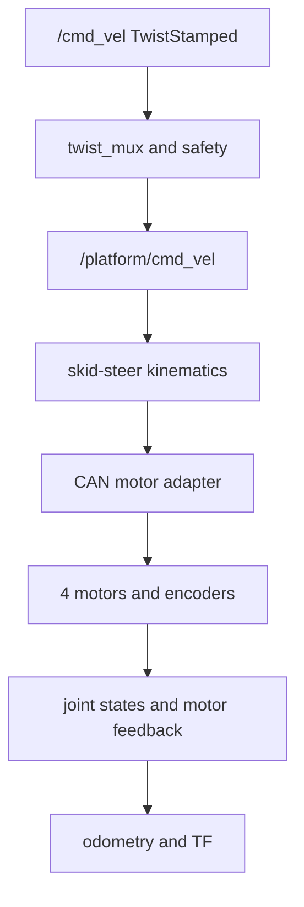

# Jackal J100 / Husky A300 ROS 2 compatibility backlog

> Status: initial implementation specification  
> Target: ROS 2 Jazzy  
> Updated: 2026-07-21  
> Scope: a four-wheel skid-steer robot that should present a Clearpath-compatible ROS 2 API

## 1. Goal

Implement a compatibility layer that lets existing ROS 2 software operate our robot as if it were a Clearpath Jackal J100. Husky A300-only interfaces are a separate extension profile.

Compatibility means more than matching topic names. A completed interface must match:

- topic, service, or action name;
- ROS interface type and field layout;
- direction, units, sign convention, and semantics;
- frame IDs and timestamps;
- Quality of Service (QoS);
- safety and timeout behaviour.

Clearpath uses a common ROS 2 API across supported robots. Jackal and Husky therefore share most high-level interfaces. Their principal difference is the motor-controller layer: Jackal J100 uses `Drive` / `DriveFeedback`; Husky A300 uses Lynx messages and adds status, lighting, fans, pin I/O, calibration, and firmware-update interfaces.

## 2. Status legend and agent rules

| Mark | Meaning |
|---|---|
| `[ ]` | Not implemented or not verified |
| `[~]` | Partially implemented; incompatibility is documented |
| `[x]` | Implemented and proven by an automated test |
| `[!]` | Blocked; issue and required decision are linked |

Agents must:

1. claim one work package at a time by adding their name and issue/PR number;
2. add a failing test before production-code changes;
3. avoid changing interface names or semantics without updating this contract;
4. attach test evidence before changing `[ ]` or `[~]` to `[x]`;
5. record discovered Clearpath-version differences under **Open decisions**.

## 3. Compatibility profiles

| Profile | Required result | Priority |
|---|---|---|
| J100 Core | Drive safely using `/cmd_vel`; publish encoder, odometry, TF, e-stop, power, temperature, and diagnostics | P0 |
| J100 Low-level | Match `Drive`, `DriveFeedback`, MCU status, and MCU configuration interfaces | P1 |
| A300 Extension | Match Lynx feedback/status plus lighting, fans, pinout, calibration, and update APIs | P2 |
| Sensor Convention | Follow Clearpath topic naming for configured lidar, camera, IMU, INS, and GNSS devices | Optional |

The initial release is complete when all P0 tasks and tests pass. Do not claim full Jackal compatibility until P1 also passes.

## 4. Architecture to implement



The CAN protocol is an internal implementation detail. ROS clients must not depend on it.

## 5. Topic contract

`IN` means our robot subscribes. `OUT` means our robot publishes. Names may receive a robot namespace; do not bake a serial-number namespace into node code.

### 5.1 J100 core and shared platform topics

| Done | Direction | Topic | Type | QoS | Required behaviour |
|---|---|---|---|---|---|
| [ ] | IN | `/cmd_vel` | `geometry_msgs/msg/TwistStamped` | System Default | Use `twist.linear.x` [m/s] and `twist.angular.z` [rad/s]; reject or ignore unsupported axes by documented policy |
| [ ] | OUT | `/platform/cmd_vel` | `geometry_msgs/msg/TwistStamped` | System Default | Publish the velocity command after mux, limits, and safety gating |
| [ ] | OUT | `/platform/joint_states` | `sensor_msgs/msg/JointState` | System Default | Four stable wheel-joint names; position [rad], velocity [rad/s], effort [N·m] if known |
| [ ] | OUT | `/platform/dynamic_joint_states` | `control_msgs/msg/DynamicJointState` | System Default | Publish controller-specific joint interfaces when supported |
| [ ] | OUT | `/platform/motors/feedback` | `clearpath_platform_msgs/msg/DriveFeedback` | Sensor Data | J100 motor current, duty cycle, temperatures, velocity, travel, and fault state |
| [ ] | IN | `/platform/motors/cmd` | `clearpath_platform_msgs/msg/Drive` | Sensor Data | J100 low-level left/right velocity or PWM command; protect with the same safety gate as `/cmd_vel` |
| [ ] | OUT | `/platform/odom` | `nav_msgs/msg/Odometry` | System Default | Wheel odometry; `header.frame_id=odom`, `child_frame_id=base_link` or the configured Clearpath-equivalent frame |
| [ ] | OUT | `/platform/odom/filtered` | `nav_msgs/msg/Odometry` | System Default | Publish only when an EKF actually fuses wheel and IMU data |
| [ ] | OUT | `/tf` | `tf2_msgs/msg/TFMessage` | System Default | Dynamic `odom -> base_*` and moving-joint transforms without duplicate publishers |
| [ ] | OUT | `/tf_static` | `tf2_msgs/msg/TFMessage` | Transient Local | Static base, sensor, and wheel transforms |
| [ ] | OUT | `/platform/emergency_stop` | `std_msgs/msg/Bool` | Sensor Data | `true` means emergency stop is active; hardware stop must not depend on ROS |
| [ ] | OUT | `/platform/bms/state` | `sensor_msgs/msg/BatteryState` | Sensor Data | Valid voltage/current/percentage fields; unknown values use the message-defined NaN convention |
| [ ] | OUT | `/diagnostics` | `diagnostic_msgs/msg/DiagnosticArray` | System Default | Report motor, encoder, CAN, battery, thermal, e-stop, and watchdog health |
| [ ] | OUT | `/robot_description` | `std_msgs/msg/String` | Transient Local | Publish the complete URDF XML |
| [ ] | OUT | `/rosout` | `rcl_interfaces/msg/Log` | Transient Local | Provided by ROS nodes; no custom publisher required |
| [ ] | OUT | `/platform/wifi_connected` | `std_msgs/msg/Bool` | System Default | Optional for driving; publish connection state when wireless watcher is installed |
| [ ] | OUT | `/platform/wifi_status` | `wireless_msgs/msg/Connection` | System Default | Optional for driving; publish signal and connection data |
| [ ] | OUT | `/joy_teleop/joy` | `sensor_msgs/msg/Joy` | System Default | Present when the Clearpath joystick profile is installed |
| [ ] | OUT | `/joy_teleop/cmd_vel` | `geometry_msgs/msg/TwistStamped` | System Default | Joystick velocity before mux |
| [ ] | OUT | `/twist_marker_server/cmd_vel` | `geometry_msgs/msg/TwistStamped` | System Default | RViz interactive-marker velocity before mux |

### 5.2 MCU and safety topics

| Done | Direction | Topic | Type | Platform | QoS | Required behaviour |
|---|---|---|---|---|---|---|
| [ ] | OUT | `/platform/mcu/status` | `clearpath_platform_msgs/msg/Status` | J100 + A300 | Sensor Data | Hardware ID, firmware version, MCU uptime, and connection uptime |
| [ ] | OUT | `/platform/mcu/status/power` | `clearpath_platform_msgs/msg/Power` | J100 + A300 | Sensor Data | Named/indexed voltage and current arrays using the selected platform profile |
| [ ] | OUT | `/platform/mcu/status/stop` | `clearpath_platform_msgs/msg/StopStatus` | J100 + A300 | Sensor Data | Stop-loop power, external-stop presence, and reset requirement |
| [ ] | OUT | `/platform/mcu/status/temperature` | `clearpath_platform_msgs/msg/Temperature` | J100 + A300 | Sensor Data | Temperature array in degrees Celsius |
| [ ] | OUT | `/platform/mcu/status/pinout` | `clearpath_platform_msgs/msg/PinoutState` | A300 | Sensor Data | Rail, input, output, and toggle-period state |
| [ ] | IN | `/platform/display/status` | `clearpath_platform_msgs/msg/DisplayStatus` | A300 | Sensor Data | Two e-ink status strings, each at most 49 characters |

### 5.3 Husky A300 extension topics

| Done | Direction | Topic | Type | QoS | Required behaviour |
|---|---|---|---|---|---|
| [ ] | IN | `/platform/motors/cmd` | `sensor_msgs/msg/JointState` | Sensor Data | Per-wheel velocity command with exact joint-name mapping |
| [ ] | OUT | `/platform/motors/feedback` | `clearpath_motor_msgs/msg/LynxMultiFeedback` | Sensor Data | Array with one driver per controlled wheel |
| [ ] | OUT | `/platform/motors/status` | `clearpath_motor_msgs/msg/LynxMultiStatus` | Sensor Data | Firmware, temperatures, stop state, warning flags, and error flags per driver |
| [ ] | IN | `/platform/cmd_fans` | `clearpath_platform_msgs/msg/Fans` | System Default | Apply indexed fan states safely |
| [ ] | IN | `/platform/cmd_lights` | `clearpath_platform_msgs/msg/Lights` | System Default | Apply four A300 RGB body-light values |

### 5.4 Optional sensor topic conventions

Implement only the rows matching installed hardware. `#` is a zero-based device index.

| Done | Topic pattern | Type |
|---|---|---|
| [ ] | `/sensors/lidar2d_#/scan` | `sensor_msgs/msg/LaserScan` |
| [ ] | `/sensors/lidar3d_#/points` | `sensor_msgs/msg/PointCloud2` |
| [ ] | `/sensors/lidar3d_#/scan` | `sensor_msgs/msg/LaserScan` |
| [ ] | `/sensors/lidar3d_#/imu/data_raw` | `sensor_msgs/msg/Imu` |
| [ ] | `/sensors/camera_#/color/image` | `sensor_msgs/msg/Image` |
| [ ] | `/sensors/camera_#/color/camera_info` | `sensor_msgs/msg/CameraInfo` |
| [ ] | `/sensors/camera_#/depth/image` | `sensor_msgs/msg/Image` |
| [ ] | `/sensors/camera_#/depth/camera_info` | `sensor_msgs/msg/CameraInfo` |
| [ ] | `/sensors/camera_#/points` | `sensor_msgs/msg/PointCloud2` |
| [ ] | `/sensors/camera_#/imu/data_raw` | `sensor_msgs/msg/Imu` |
| [ ] | `/sensors/imu_#/data_raw` | `sensor_msgs/msg/Imu` |
| [ ] | `/sensors/imu_#/data` | `sensor_msgs/msg/Imu` |
| [ ] | `/sensors/imu_#/mag` | `sensor_msgs/msg/MagneticField` |
| [ ] | `/sensors/ins_#/imu_0/data` | `sensor_msgs/msg/Imu` |
| [ ] | `/sensors/ins_#/gps_0/fix` | `sensor_msgs/msg/NavSatFix` |
| [ ] | `/sensors/ins_#/gps_1/fix` | `sensor_msgs/msg/NavSatFix` |
| [ ] | `/sensors/ins_#/odom` | `nav_msgs/msg/Odometry` |
| [ ] | `/sensors/gps_#/fix` | `sensor_msgs/msg/NavSatFix` |

## 6. Service and action contract

| Done | Kind | Name | Type | Platform | Required behaviour |
|---|---|---|---|---|---|
| [ ] | Service | `/platform/mcu/configure` | `clearpath_platform_msgs/srv/ConfigureMcu` | J100 + A300 | Store/apply ROS domain ID and robot namespace; return a useful error message |
| [ ] | Service | `/platform/mcu/clear_estop_needs_reset` | `std_srvs/srv/Empty` | A300 | Clear only the reset latch; never override an active hardware stop |
| [ ] | Service | `/platform/pinout/aux_#` | `clearpath_platform_msgs/srv/SetPinout` | A300 | Set/toggle indexed auxiliary output |
| [ ] | Service | `/platform/pinout/gpo_#` | `clearpath_platform_msgs/srv/SetPinout` | A300 | Set/toggle indexed general-purpose output |
| [ ] | Service | `/platform/pinout/user_pwr_ctrl` | `std_srvs/srv/SetBool` | A300 | Enable/disable the user power rail |
| [ ] | Action | `/platform/motors/calibrate` | `clearpath_motor_msgs/action/LynxCalibrate` | A300 | Calibrate controllers and return offsets |
| [ ] | Action | `/platform/motors/update` | `clearpath_motor_msgs/action/LynxUpdate` | A300 | Update motor-controller firmware with progress and per-driver result |

## 7. Exact Clearpath custom message formats

These definitions are copied structurally from the `jazzy` branch of `clearpathrobotics/clearpath_msgs`. Comments below state the required semantics but are not part of DDS serialization.

### 7.1 Jackal motor messages

```text
# clearpath_platform_msgs/msg/Drive
int8 MODE_VELOCITY=0
int8 MODE_PWM=1
int8 MODE_NONE=-1
int8 mode
int8 LEFT=0
int8 RIGHT=1
float32[2] drivers
```

- `MODE_VELOCITY`: `drivers` contains wheel angular velocity in rad/s.
- `MODE_PWM`: `drivers` is limited to `[-1.0, 1.0]`.
- A positive left or right command propels that side of the chassis forward.

```text
# clearpath_platform_msgs/msg/DriveFeedback
float32 current
float32 duty_cycle
float32 bridge_temperature
float32 motor_temperature
float32 measured_velocity
float32 measured_travel
bool driver_fault
```

Units: current [A], temperature [°C], velocity [rad/s], travel [rad].

### 7.2 Shared MCU messages

```text
# clearpath_platform_msgs/msg/Status
std_msgs/Header header
string hardware_id
string firmware_version
builtin_interfaces/Duration mcu_uptime
builtin_interfaces/Duration connection_uptime

# clearpath_platform_msgs/msg/StopStatus
std_msgs/Header header
bool stop_power_status
bool external_stop_present
bool needs_reset

# clearpath_platform_msgs/msg/Temperature
std_msgs/Header header
float32[] temperatures

# clearpath_platform_msgs/msg/Power
std_msgs/Header header
int8 NOT_APPLICABLE=-1
int8 shore_power_connected
int8 battery_connected
int8 power_12v_user_nominal
int8 charger_connected
int8 charging_complete
float32[] measured_voltages
float32[] measured_currents
```

Important `Power` indices for the J100 profile:

```text
uint8 J100_MEASURED_BATTERY=0
uint8 J100_MEASURED_5V=1
uint8 J100_MEASURED_12V=2
uint8 J100_TOTAL_CURRENT=0
uint8 J100_COMPUTER_CURRENT=1
uint8 J100_DRIVE_CURRENT=2
uint8 J100_USER_CURRENT=3
```

The A300 uses the Common Core (`CC01_*`) indices defined in the upstream `Power.msg`; do not reuse the legacy A200 indices.

### 7.3 Husky A300 motor messages

```text
# clearpath_motor_msgs/msg/LynxFeedback
uint8 can_id
string joint_name
float32 current
float32 voltage
float32 velocity
float32 travel

# clearpath_motor_msgs/msg/LynxMultiFeedback
std_msgs/Header header
clearpath_motor_msgs/LynxFeedback[] drivers
```

Units: RMS current [A], voltage [V], angular velocity [rad/s], total wheel travel [rad].

```text
# clearpath_motor_msgs/msg/LynxStatus
uint8 can_id
string joint_name
string firmware_version
float32 motor_temperature
float32 mcu_temperature
float32 pcb_temperature
bool stopped
uint32 status_flags
uint32 warning_flags
uint32 error_flags

# clearpath_motor_msgs/msg/LynxMultiStatus
std_msgs/Header header
clearpath_motor_msgs/LynxStatus[] drivers
```

`LynxStatus` flag bit numbers:

| Field | Bit names |
|---|---|
| `status_flags` | 0 ADC calibrated; 1 FOC enabled; 2 calibration requested; 3 calibration cancelled; 4 e-stopped |
| `warning_flags` | 0 motor thermistor; 1 PCB thermistor; 2 phase; 3 phase A; 4 phase B; 5 phase C; 6 encoder index; 7 encoder A; 8 encoder B |
| `error_flags` | 0 not calibrated; 1 motor fault; 2 motor stalling; 3 motor thermistor; 4 PCB thermistor; 5 phase; 6 phase A; 7 phase B; 8 phase C; 9 encoder power; 10 encoder index; 11 encoder A; 12 encoder B |

### 7.4 A300 auxiliary messages

```text
# clearpath_platform_msgs/msg/Fans
uint8 FAN_OFF=0
uint8 FAN_ON_HIGH=1
uint8 FAN_ON_LOW=2
uint8[] fans

# clearpath_platform_msgs/msg/Lights
uint8 A300_LIGHTS_FRONT_RIGHT=0
uint8 A300_LIGHTS_FRONT_LEFT=1
uint8 A300_LIGHTS_REAR_LEFT=2
uint8 A300_LIGHTS_REAR_RIGHT=3
clearpath_platform_msgs/RGB[] lights

# clearpath_platform_msgs/msg/PinoutState
std_msgs/Header header
bool[] rails
bool[] inputs
bool[] outputs
uint32[] output_periods

# clearpath_platform_msgs/msg/DisplayStatus
string<=49 string1
string<=49 string2
```

### 7.5 Custom services and actions

```text
# clearpath_platform_msgs/srv/ConfigureMcu
uint8 domain_id
string robot_namespace
---
bool success
string message

# clearpath_platform_msgs/srv/SetPinout
bool state
uint32 toggle_period
---
bool success
string message
```

`toggle_period` is milliseconds, minimum 100 ms; `0` disables toggling.

```text
# clearpath_motor_msgs/action/LynxCalibrate
---
float32[] offset
---
uint16[] iteration

# clearpath_motor_msgs/action/LynxUpdate
string file
---
bool[] success
---
float32[] progress
```

## 8. Standard ROS 2 message formats used directly

The project should depend on upstream ROS packages rather than copying standard definitions. The following abridged schemas show every direct field needed by this contract; nested standard types remain upstream dependencies.

```text
# geometry_msgs/msg/TwistStamped
std_msgs/Header header
geometry_msgs/Twist twist
  geometry_msgs/Vector3 linear
  geometry_msgs/Vector3 angular

# sensor_msgs/msg/JointState
std_msgs/Header header
string[] name
float64[] position
float64[] velocity
float64[] effort

# nav_msgs/msg/Odometry
std_msgs/Header header
string child_frame_id
geometry_msgs/PoseWithCovariance pose
geometry_msgs/TwistWithCovariance twist

# std_msgs/msg/Bool
bool data

# std_msgs/msg/String
string data

# tf2_msgs/msg/TFMessage
geometry_msgs/TransformStamped[] transforms

# sensor_msgs/msg/Joy
std_msgs/Header header
float32[] axes
int32[] buttons

# diagnostic_msgs/msg/DiagnosticArray
std_msgs/Header header
diagnostic_msgs/DiagnosticStatus[] status
```

`sensor_msgs/msg/BatteryState`, `control_msgs/msg/DynamicJointState`, `rcl_interfaces/msg/Log`, and all optional sensor schemas must be consumed from the installed ROS 2 Jazzy interface packages. Validate the installed layout with `ros2 interface show <type>` in CI; do not maintain local forks.

## 9. Functions/modules to implement

### WP-01 — Package and interface contract

Owner: `unassigned` · Issue/PR: `TBD`

- [ ] Create the ROS 2 package layout and dependency manifest.
- [ ] Pin/test the intended `clearpath_msgs` Jazzy version.
- [ ] Add configurable namespace and frame prefix.
- [ ] Add a launch file for `j100` and a separate `a300_extension` profile.
- [ ] Fail fast when required parameters, joint names, or CAN devices are invalid.

### WP-02 — Velocity command and skid-steer kinematics

Owner: `unassigned` · Issue/PR: `TBD`

- [ ] Implement `TwistStamped` subscription and timestamp policy.
- [ ] Implement linear/angular velocity and acceleration limits.
- [ ] Convert body twist to left/right wheel rad/s using effective wheel radius and track width.
- [ ] Map one side command to front and rear motors without sign inversions.
- [ ] Publish the accepted command on `/platform/cmd_vel`.
- [ ] Stop on command timeout and reject stale commands.

Suggested pure functions:

```text
validate_twist(command, limits) -> ValidationResult
limit_twist(command, previous, dt, limits) -> Twist
twist_to_wheel_speeds(linear_x, angular_z, geometry) -> WheelSpeeds
apply_side_mapping(left, right, motor_map) -> MotorCommands[4]
```

### WP-03 — CAN motor-controller adapter

Owner: `unassigned` · Issue/PR: `TBD`

- [ ] Define an internal typed motor command/feedback struct independent of ROS.
- [ ] Send four motor velocity commands at the required control rate.
- [ ] Read encoder position/speed, motor current, controller temperature, motor temperature, voltage, and faults.
- [ ] Detect stale frames, bus-off, controller reboot, and encoder discontinuity.
- [ ] Map CAN data to J100 and optional A300 ROS messages.
- [ ] Document which desired feedback is unavailable from the purchased controllers.

### WP-04 — Encoder, joint-state, and odometry pipeline

Owner: `unassigned` · Issue/PR: `TBD`

- [ ] Convert encoder counts to rad and rad/s with explicit resolution and gear ratio.
- [ ] Handle counter wrap, reboot, sign, and implausible jumps.
- [ ] Publish four joint states with stable names and synchronized timestamps.
- [ ] Fuse front/rear encoders per side using a documented fault-tolerant rule.
- [ ] Integrate skid-steer odometry and fill pose/twist covariances.
- [ ] Publish TF with one authoritative `odom` transform source.

Suggested pure functions:

```text
unwrap_encoder(current, previous, counter_bits) -> DeltaCounts
counts_to_radians(counts, counts_per_revolution, gear_ratio) -> float
estimate_side_velocity(front, rear, health) -> Estimate
integrate_skid_steer(previous_pose, left_delta, right_delta, geometry) -> Pose2D
```

### WP-05 — Safety, e-brake, and watchdog

Owner: `unassigned` · Issue/PR: `TBD`

- [ ] Implement a hardware e-stop input and independent power/torque removal path.
- [ ] Publish e-stop and stop-loop status with correct polarity.
- [ ] Gate both high-level and low-level motor commands.
- [ ] Require an explicit safe reset after e-stop when configured.
- [ ] Define behaviour for CAN loss, encoder loss, overcurrent, overtemperature, stale command, and ROS shutdown.
- [ ] Distinguish regenerative braking from a fail-safe parking/emergency brake.

### WP-06 — Power, thermal, and diagnostics

Owner: `unassigned` · Issue/PR: `TBD`

- [ ] Publish `BatteryState` and Clearpath `Power` consistently.
- [ ] Publish motor temperature received from each motor/controller.
- [ ] Apply warning, derating, and shutdown thresholds.
- [ ] Publish diagnostic status with stable hardware IDs and actionable text.
- [ ] Report data age so frozen telemetry is not mistaken for healthy telemetry.

### WP-07 — Husky A300 extension

Owner: `unassigned` · Issue/PR: `TBD`

- [ ] Implement `LynxMultiFeedback` adapter for four motor channels.
- [ ] Implement `LynxMultiStatus` flags from controller faults.
- [ ] Implement fan and RGB-light commands if hardware exists.
- [ ] Implement pinout services if hardware exists.
- [ ] Implement calibration/update actions only when transactional safety can be guaranteed.

### WP-08 — Description, launch, and configuration

Owner: `unassigned` · Issue/PR: `TBD`

- [ ] Create URDF/xacro with correct wheel joints, frames, dimensions, inertias, and sensor mounts.
- [ ] Publish `robot_description` transient-local.
- [ ] Supply controller, geometry, limits, CAN IDs, thermal limits, and encoder parameters in explicit YAML.
- [ ] Add example namespaces for single- and multi-robot use.

## 10. Test checklist

### 10.1 Static and interface contract tests

- [ ] `ros2 topic list -t` contains every enabled profile topic with the exact type.
- [ ] `ros2 service list -t` and `ros2 action list -t` match enabled profiles.
- [ ] Publisher/subscriber direction is correct.
- [ ] QoS history, depth, reliability, and durability match this document.
- [ ] `ros2 interface show` matches the expected installed message definitions.
- [ ] URDF passes `check_urdf`; TF tree has no loops or duplicate parents.

### 10.2 Unit tests

- [ ] Zero twist produces four zero wheel commands.
- [ ] Positive `linear.x` produces forward motion on all wheels despite physical motor orientation.
- [ ] Positive `angular.z` produces the ROS-standard left turn.
- [ ] Pure rotation produces equal and opposite side speeds.
- [ ] Velocity/acceleration saturation is deterministic at all boundaries.
- [ ] NaN, infinity, invalid mode, invalid array length, and stale timestamp fail safely.
- [ ] Encoder conversion covers forward, reverse, wrap, reboot, and dropped samples.
- [ ] Odometry covers straight, arc, in-place turn, zero `dt`, and large-gap rejection.
- [ ] Diagnostic and Lynx bit masks map every warning/error bit correctly.

### 10.3 Integration tests with simulated CAN

- [ ] Commands reach all four expected CAN IDs.
- [ ] A missing controller or one stale wheel causes the specified degraded/stop state.
- [ ] Encoder and temperature frames produce correct ROS fields and units.
- [ ] Bus-off and recovery do not create a motion pulse.
- [ ] Controller reboot does not create a travel/odometry jump.
- [ ] Command timeout sends/holds zero torque or the configured safe brake command.

### 10.4 Hardware-in-the-loop safety tests

- [ ] Run first with wheels raised and a physical e-stop within reach.
- [ ] Verify every wheel direction at low speed.
- [ ] Verify measured velocity/travel sign against commanded forward motion.
- [ ] Activate e-stop while moving; measure stop response and prove ROS cannot restart motion.
- [ ] Disconnect command source, CAN, encoder, and temperature sensor separately; verify safe response.
- [ ] Verify current and temperature limits under controlled load.
- [ ] Verify that a full battery or disabled regeneration does not defeat the required brake behaviour.

### 10.5 Compatibility acceptance test

- [ ] Launch the same Nav2/teleop client configuration used with the target Clearpath profile.
- [ ] Drive a measured straight line and compare encoder travel and odometry.
- [ ] Execute clockwise/counter-clockwise in-place rotations and compare heading.
- [ ] Record a rosbag containing commands, feedback, odometry, TF, power, diagnostics, and e-stop.
- [ ] Run an automated bag validator for topic/type presence, frequency, timestamps, units, and frame IDs.
- [ ] Store the validation report as a CI artifact and link it here.

## 11. Useful inspection commands

```bash
ros2 topic list -t
ros2 service list -t
ros2 action list -t
ros2 topic info /cmd_vel -v
ros2 topic info /platform/motors/feedback -v
ros2 interface show clearpath_platform_msgs/msg/Drive
ros2 interface show clearpath_platform_msgs/msg/DriveFeedback
ros2 interface show clearpath_motor_msgs/msg/LynxMultiFeedback
ros2 interface show clearpath_motor_msgs/msg/LynxMultiStatus
ros2 topic echo --once /platform/joint_states
ros2 topic echo --once /platform/odom
ros2 run tf2_tools view_frames
```

## 12. Open decisions

- [ ] Confirm whether wire/API compatibility targets J100 only or also binary/package compatibility with Clearpath packages.
- [ ] Confirm exact Clearpath release/tag or commit to use; the moving `jazzy` branch alone is not a reproducible dependency.
- [ ] Confirm exact joint names and Clearpath namespace required by downstream applications.
- [ ] Confirm motor-controller CAN protocol, channel mapping, continuous current, and telemetry availability.
- [ ] Confirm encoder type, counts per revolution, index behaviour, gear ratio, and persistence across reboot.
- [ ] Confirm motor-temperature sensor type and whether each motor exposes it over CAN.
- [ ] Measure effective wheel radius, track width, and skid-steer separation multiplier under load.
- [ ] Decide whether four independent motor feedback messages or a compatibility aggregator will represent the J100 two-side abstraction.
- [ ] Decide e-brake/reset semantics and the separate fail-safe parking-brake design.
- [ ] Define minimum publication rates and maximum allowed telemetry age per topic.

## 13. References

Primary sources:

- [Clearpath ROS 2 Robot API overview (Jazzy)](https://docs.clearpathrobotics.com/docs/ros/api/overview/)
- [Clearpath ROS 2 Platform API (Jazzy)](https://docs.clearpathrobotics.com/docs/ros/api/platform_api/)
- [Clearpath ROS 2 MCU API (Jazzy)](https://docs.clearpathrobotics.com/docs/ros/api/mcu_api/)
- [Clearpath ROS 2 Sensors API (Jazzy)](https://docs.clearpathrobotics.com/docs/ros/api/sensors_api/)
- [Clearpath lighting API](https://docs.clearpathrobotics.com/docs/ros/api/lighting/)
- [`clearpathrobotics/clearpath_msgs`, `jazzy` branch](https://github.com/clearpathrobotics/clearpath_msgs/tree/jazzy)
- [`Drive.msg`](https://github.com/clearpathrobotics/clearpath_msgs/blob/jazzy/clearpath_platform_msgs/msg/Drive.msg)
- [`DriveFeedback.msg`](https://github.com/clearpathrobotics/clearpath_msgs/blob/jazzy/clearpath_platform_msgs/msg/DriveFeedback.msg)
- [`LynxFeedback.msg`](https://github.com/clearpathrobotics/clearpath_msgs/blob/jazzy/clearpath_motor_msgs/msg/LynxFeedback.msg)
- [`LynxStatus.msg`](https://github.com/clearpathrobotics/clearpath_msgs/blob/jazzy/clearpath_motor_msgs/msg/LynxStatus.msg)
- [ROS 2 Jazzy standard message definitions](https://github.com/ros2/common_interfaces/tree/jazzy)

Source check date: 2026-07-21. Re-run the contract tests whenever the pinned Clearpath or ROS 2 dependency changes.
