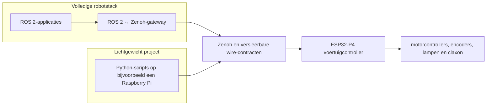

# Projectvisie en platformarchitectuur

> Status: richtinggevend projectdocument
> Beoogde platformen: eigen skid-steervoertuig, Clearpath Jackal J100 en Husky A300
> Besturingsgrens: ROS 2 op Linux, Zenoh naar een ESP32-P4
> Bijgewerkt: 2026-07-24

## 1. Aanleiding

Dit project bouwt een nieuwe generatie mobiel voertuig vanuit hetzelfde bruikbare
basisidee als de Clearpath Jackal en Husky: een robuust skid-steerplatform waarop
verschillende sensoren, computers en andere payloads kunnen worden geplaatst. Het
doel is niet om een van die robots mechanisch exact te kopiëren. We behouden wat
goed werkt en passen het platform aan waar onze toepassing daar om vraagt:

- meer vrijheid in formaat, voeding en montage van payloads;
- grotere motoren en bijpassende motorcontrollers;
- een iets andere wielbasis en voertuigdynamica;
- eigen encoders en een eigen odometrieketen;
- een modulaire computer- en netwerkarchitectuur;
- ruimte voor zowel volledige ROS 2-systemen als kleine onderwijsprojecten.

De nieuwe mechanica en elektronica mogen integratie met bestaande robotsoftware
niet onnodig moeilijk maken. Daarom gebruiken we de Jackal J100- en Husky
A300-interfaces als herkenbaar extern contract voor ROS 2 en volgen we de
Clearpath-indeling voor het interne netwerk.

## 2. Wat compatibiliteit in dit project betekent

Compatibiliteit is doelgericht en aantoonbaar. Het is geen algemene claim dat
ieder onderdeel zonder configuratie uitwisselbaar is.

| Gebied | Doel |
|---|---|
| ROS 2 API | De gekozen Jackal/Husky-topics, types, QoS, frames, eenheden en foutsemantiek volgen. |
| Netwerk | Het Clearpath-subnet en de gereserveerde adresblokken volgen, zodat computers en add-ons voorspelbare adressen hebben. |
| Applicaties | Bestaande teleop-, logging-, visualisatie- en uiteindelijk navigatiesoftware met zo weinig mogelijk platformspecifieke aanpassing gebruiken. |
| Gedrag | Commando-timeouts, e-stop, watchdogs en statusinformatie expliciet en testbaar maken. |
| Mechanica | Niet identiek: wielbasis, payloadruimte, motoren en mogelijk wielmaten zijn projectconfiguratie. |
| Aandrijfelektronica | Niet identiek: controller- en encoderprotocollen blijven achter interne adapters verborgen. |

Een fysiek verschil, zoals de effectieve spoorbreedte of wielstraal, wordt dus
niet gemaskeerd met een verkeerde constante. Het krijgt een gekalibreerde
configuratiewaarde, terwijl de buitenkant dezelfde ROS-eenheden en semantiek
houdt. De concrete ROS 2-backlog staat in
[`CLEARPATH_ROS2_COMPATIBILITY_TODO.md`](CLEARPATH_ROS2_COMPATIBILITY_TODO.md).

## 3. De splitsing tussen Linux en ESP32-P4

De ESP32-P4 moet een compacte, herbruikbare voertuigcontroller blijven. Daarom
kent de firmware geen ROS 2-topics, ROS graph, dynamische ROS-berichttypen of
Clearpath-packages. De controller communiceert met kleine, expliciete en
versieerbare berichten via Zenoh.

Deze grens heeft twee functies:

1. de Linuxgateway vertaalt een rijk ecosysteemcontract naar kleine embedded
   berichten;
2. de ESP32-P4 voert hardwarefuncties en lokale veiligheidsregels uit zonder van
   ROS 2 afhankelijk te zijn.

De gateway is dus geen toevallige transportbridge. Hij is de bewuste
anti-corruptielaag tussen ROS 2/Clearpath-semantiek en een platformneutrale
embedded controller. De technische uitwerking staat in
[`ROS2_ZENOH_GATEWAY_ARCHITECTURE_PLAN.md`](ROS2_ZENOH_GATEWAY_ARCHITECTURE_PLAN.md).

## 4. Twee gelijkwaardige gebruiksprofielen

### 4.1 Volledig ROS 2-compatibel voertuig

Op de robotcomputer draaien ROS 2 Jazzy, de compatibiliteitsnodes, de
ROS 2-Zenoh-gateway en een lokale Zenoh-router. Voor ROS 2-clients gedraagt het
voertuig zich volgens het gekozen Jackal J100-profiel en later waar nodig volgens
het Husky A300-uitbreidingsprofiel.

De ESP32-P4 ontvangt alleen gevalideerde voertuig- en I/O-opdrachten. Encoder-,
controller- en statusdata gaan via dezelfde grens terug en worden op Linux naar
ROS 2-berichten vertaald.

### 4.2 Lichtgewicht onderwijs- of prototypeproject

Een student hoeft niet eerst ROS 2, launch files, discovery, QoS en de volledige
robotinfrastructuur te leren om een basisexperiment uit te voeren. Een Raspberry
Pi, een webcam en enkele kleine Python-scripts kunnen rechtstreeks via het
gedocumenteerde Zenoh-contract:

- een begrensd rijcommando sturen;
- stoppen en de actuele veiligheidsstatus lezen;
- lampen schakelen of laten knipperen;
- de claxon kort activeren;
- encoder- of eenvoudige odometriedata lezen.

Zo ligt de nadruk bij bijvoorbeeld een lijn- of circuitrijder op waarnemen,
beslissen, sturen en meten. Later kan hetzelfde voertuig alsnog met de volledige
ROS 2-stack worden gebruikt zonder de ESP32-firmware te vervangen.

Dit lichte profiel verandert de safetygrens niet. Ook een eenvoudig script kan
geen fysieke e-stop opheffen, geen verlopen commando geldig houden en geen lokale
motorlimiet omzeilen.

## 5. Verantwoordelijkheden per laag

| Laag | Verantwoordelijk voor | Bewust niet verantwoordelijk voor |
|---|---|---|
| ROS 2-applicaties | Teleop, navigatie, visualisatie, logging en sensorfusie | Directe motor- of GPIO-aansturing |
| Compatibiliteitslaag | Jackal/Husky-namen, typen, QoS, frames en configuratieprofielen | Hardwareprotocollen |
| ROS 2-Zenoh-gateway | Whitelist, vertaling, validatie, versiecontrole en observability | Harde realtime en fysieke safety |
| Zenoh-router/netwerk | Bereikbaarheid tussen geautoriseerde endpoints | Betekenis van voertuigcommando's |
| ESP32-P4 | Watchdog, safety state, skid-steerdoelen, motor-I/O, encoderinname en eenvoudige accessoires | ROS 2-discovery en Clearpath-berichttypen |
| Motorcontroller/encoder | Gesloten regelkring en ruwe hardwarefeedback volgens de gekozen componenten | Platform- of ROS 2-API |

De verdeling van motion, watchdog, e-stop en odometrie is verder uitgewerkt in
[`MOTION_CORE_IMPLEMENTATION_PLAN.md`](MOTION_CORE_IMPLEMENTATION_PLAN.md).

## 6. Netwerk als onderdeel van compatibiliteit

Het interne netwerk gebruikt dezelfde hoofdindeling als Clearpath:
`192.168.131.0/24`. De primaire robotcomputer, MCU, camera's, lidars, GNSS,
radio's en extra computers krijgen adressen uit hun vaste functieblok. Dit maakt
een voertuig herkenbaar voor mensen die Jackal of Husky kennen en voorkomt dat
iedere payloadintegratie een nieuw adresplan introduceert.

De volledige rationale, adreslijst, configuratieregels en acceptatietests staan
in [`ROBOT_NETWORK_SETUP.md`](ROBOT_NETWORK_SETUP.md). Dat document is
normatief voor adressen binnen dit project; het apparaatregister van een concreet
voertuig moet daarbinnen uniek blijven.

## 7. Ontwerpprincipes

1. **Stabiele buitengrens, vervangbare binnenkant.** Mechanica, motorcontroller
   en encoder mogen veranderen zonder ROS 2-clients of studentenscripts
   onnodig te breken.
2. **Eenvoudige embedded contracten.** Berichten zijn klein, begrensd,
   versieerbaar en ook zonder ROS 2 te implementeren.
3. **Safety is lokaal.** Een netwerk, Linuxproces of script is nooit nodig om
   veilig te stoppen.
4. **Configuratie boven aannames.** Wielgeometrie, limieten, CAN-mapping,
   netwerkendpoint en geïnstalleerde payloads zijn expliciete configuratie.
5. **Compatibiliteit wordt getest.** Namen alleen zijn onvoldoende; gedrag,
   timing, foutpaden en herstel horen bij het contract.
6. **Begin met een kleine verticale slice.** Eerst GPIO zonder bewegingsrisico,
   daarna motion zonder motoroutput, vervolgens gecontroleerde hardwaretests.
7. **Onderwijs blijft toegankelijk.** De eenvoudige route is een ondersteund
   gebruiksprofiel en geen ongedocumenteerde omweg om de ROS 2-stack.

## 8. Documenten en beslisvolgorde

Gebruik de documenten in deze volgorde bij een ontwerpwijziging:

1. dit document bepaalt doel, scope en systeemgrenzen;
2. [`ROBOT_NETWORK_SETUP.md`](ROBOT_NETWORK_SETUP.md) bepaalt de
   netwerkidentiteit en adresindeling;
3. [`ROS2_ZENOH_GATEWAY_ARCHITECTURE_PLAN.md`](ROS2_ZENOH_GATEWAY_ARCHITECTURE_PLAN.md)
   bepaalt de Linux-embedded integratiegrens;
4. [`MOTION_CORE_IMPLEMENTATION_PLAN.md`](MOTION_CORE_IMPLEMENTATION_PLAN.md)
   bepaalt motion-, odometrie- en safetygedrag;
5. [`CLEARPATH_ROS2_COMPATIBILITY_TODO.md`](CLEARPATH_ROS2_COMPATIBILITY_TODO.md)
   bepaalt welke externe ROS 2-contracten nog moeten worden bewezen;
6. [`DEVELOPMENT_ENVIRONMENT_SETUP.md`](DEVELOPMENT_ENVIRONMENT_SETUP.md)
   bepaalt de reproduceerbare ontwikkel- en robotruntime.

Bij een conflict krijgt fysieke veiligheid altijd voorrang. Een bewuste
afwijking van een compatibiliteitscontract moet worden gedocumenteerd en getest;
zij mag niet stil in firmware of configuratie ontstaan.
