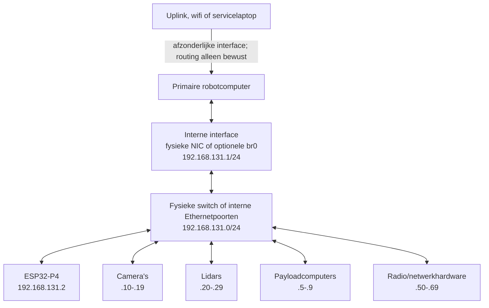

# Intern robotnetwerk en IP-adresplan

> Status: vastgesteld adresplan; concrete apparatenregistratie nog per voertuig in te vullen
> Compatibiliteitsbasis: Clearpath ROS 2 Jazzy reserved IP addresses
> Intern subnet: `192.168.131.0/24`
> Bijgewerkt: 2026-07-24

## 1. Doel en rationale

Alle computers, controllers en Ethernet-payloads op het voertuig gebruiken een
voorspelbaar intern netwerk. We nemen daarvoor de Clearpath-indeling over. Dat
levert drie voordelen op:

- een Jackal- of Husky-gebruiker herkent de plaats van computers, MCU's en
  sensoren;
- documentatie, configuratie en diagnose kunnen vaste functionele adresblokken
  gebruiken;
- nieuwe payloads krijgen een adres zonder een nieuw, projectspecifiek schema te
  verzinnen.

Clearpath reserveert `192.168.131.0/24` voor interne communicatie tussen
computers, MCU's, sensoren, manipulatoren en andere netwerkcomponenten. Dit
project gebruikt dezelfde grens als onderdeel van de beoogde platformcompatibiliteit.
De achterliggende project- en architectuurkeuzes staan in
[`PROJECT_VISION_AND_ARCHITECTURE.md`](PROJECT_VISION_AND_ARCHITECTURE.md).

## 2. Normatieve netwerkregels

| Eigenschap | Projectwaarde |
|---|---|
| IPv4-netwerk | `192.168.131.0/24` |
| Subnetmasker | `255.255.255.0` |
| Netwerkadres | `192.168.131.0` — niet aan een apparaat toewijzen |
| Broadcastadres | `192.168.131.255` |
| Statische infrastructuur en payloads | `192.168.131.1` t/m `.99`, volgens de functietabel |
| DHCP-/tijdelijke clients | `192.168.131.100` t/m `.254` |
| Primair Zenoh-routeradres | `192.168.131.1` |
| Primaire Linux-interface | Nog te kiezen: één fysieke NIC of `br0`; `.1/24` wordt precies eenmaal toegekend |

Aanvullende regels:

1. ieder IPv4-adres mag op één gekoppeld Layer-2-netwerk maar één eigenaar
   hebben;
2. infrastructuur en vaste payloads krijgen lokaal een statisch adres;
   willekeurige DHCP-clients gebruiken alleen `.100-.254`;
3. een apparaat uit een benoemde familie blijft in het bijbehorende blok;
4. `.70-.99` is overflow, geen eerste keuze;
5. een IP-adres is geen safety- of authenticatiemechanisme;
6. de statische interne configuratie definieert geen default route of
   internettoegang; een extra uplinkroute is een afzonderlijke deploymentkeuze;
7. de fysieke e-stop en lokale watchdog blijven werken wanneer het hele netwerk
   uitvalt.

## 3. Projecttoewijzing voor de kern

Dit zijn de vaste rollen voor ieder voertuig. `Gereserveerd` betekent dat het
adres vrij blijft totdat de genoemde functie werkelijk aanwezig is.

| Adres | Functie in dit project | Status/opmerking |
|---|---|---|
| `192.168.131.1` | Primaire robotcomputer | Draait de ROS 2-compatibiliteitslaag, `ros2_zenoh_gateway`, `zenohd` en de hoofdconfiguratie. |
| `192.168.131.2` | ESP32-P4 voertuigcontroller/MCU | Draait Zenoh-Pico, motion core, watchdog en hardware-I/O. |
| `192.168.131.3-.4` | Aanvullende MCU's | Gereserveerd voor een zelfstandige power-, safety- of payloadcontroller. |
| `192.168.131.5` | Secundaire computer | Gereserveerd voor bijvoorbeeld zware perceptie of een NVIDIA Jetson als die niet de primaire computer is. |
| `192.168.131.6` | Tertiaire computer | Gereserveerd voor een aanvullende payloadcomputer. |
| `192.168.131.7-.9` | Extra computers | Gereserveerd; eerst `.5` en `.6` gebruiken. |
| `192.168.131.10` | Primaire/frontcamera | Eerste voorkeursadres wanneer aanwezig. |
| `192.168.131.11` | Secundaire/rearcamera | Eerste voorkeursadres wanneer aanwezig. |
| `192.168.131.20` | Primaire/frontlidar | Eerste voorkeursadres wanneer aanwezig. |
| `192.168.131.21` | Secundaire/rearlidar | Eerste voorkeursadres wanneer aanwezig. |
| `192.168.131.31` | Primaire positie-GNSS | `.30` blijft voor een GNSS-basisstation. |
| `192.168.131.32` | Secundaire heading-GNSS | Alleen wanneer aanwezig. |
| `192.168.131.51` | Interne/onboard radio | Alleen wanneer een afzonderlijke netwerk-radio aanwezig is. |

De primaire robotcomputer is het vaste Zenoh-routerendpoint. Firmware en
hostsoftware lezen het volledige endpoint uit configuratie; handlers coderen het
adres of de transportpoort niet zelf hard. Het netwerk mag uitvallen zonder dat
de ESP32-P4 zijn veilige lokale toestand verliest. Zie
[`ROS2_ZENOH_GATEWAY_ARCHITECTURE_PLAN.md`](ROS2_ZENOH_GATEWAY_ARCHITECTURE_PLAN.md)
voor de router- en clientrollen.

## 4. Volledige Clearpath-compatibele adresindeling

Onderstaande tabel is de genormaliseerde projectweergave van de Clearpath
ROS 2 Jazzy-tabel. Benoemde voorkeursadressen zijn afzonderlijk vermeld; de rest
van ieder blok blijft beschikbaar voor meer apparaten van dezelfde familie.

| Familie | Functie | Adres of bereik |
|---|---|---|
| Computers en MCU's | Primaire computer | `192.168.131.1` |
| Computers en MCU's | MCU's | `192.168.131.2-.4` |
| Computers en MCU's | Secundaire computer | `192.168.131.5` |
| Computers en MCU's | Tertiaire computer | `192.168.131.6` |
| Computers en MCU's | Overige computers | `192.168.131.7-.9` |
| Camera en vision | Primair/front | `192.168.131.10` |
| Camera en vision | Secundair/rear | `192.168.131.11` |
| Camera en vision | Overige camera's/vision | `192.168.131.12-.19` |
| 2D- en 3D-lidar | Primair/front | `192.168.131.20` |
| 2D- en 3D-lidar | Secundair/rear | `192.168.131.21` |
| 2D- en 3D-lidar | Tertiair | `192.168.131.22` |
| 2D- en 3D-lidar | Overige lidars | `192.168.131.23-.29` |
| GPS/GNSS | Basisstation | `192.168.131.30` |
| GPS/GNSS | Primair/positie | `192.168.131.31` |
| GPS/GNSS | Secundair/heading | `192.168.131.32` |
| GPS/GNSS | Overige ontvangers | `192.168.131.33-.34` |
| Sonar | Primair | `192.168.131.35` |
| Sonar | Secundair | `192.168.131.36` |
| Sonar | Overige sonar | `192.168.131.37-.39` |
| Armen | Primair/links | `192.168.131.40` |
| Armen | Secundair/rechts | `192.168.131.41` |
| Armen | Overige armen | `192.168.131.42-.44` |
| Grippers | Primair/linkerhand | `192.168.131.45` |
| Grippers | Secundair/rechterhand | `192.168.131.46` |
| Grippers | Overige grippers | `192.168.131.47-.49` |
| Radio | Basisstation | `192.168.131.50` |
| Radio | Intern/onboard | `192.168.131.51` |
| Netwerkhardware | Aanvullende radio's | `192.168.131.52-.69` |
| Niet toegewezen | Overflow voor andere blokken | `192.168.131.70-.99` |
| DHCP/tijdelijke clients | DHCP of bewust statische client | `192.168.131.100-.254` |
| Broadcast | Subnetbroadcast | `192.168.131.255` |

### Bronnormalisatie

De geraadpleegde Clearpath-pagina toont in het computerblok `.8` tweemaal en in
het camerablok `.15` tweemaal, terwijl `.7` en `.16` ontbreken. De omliggende
familieblokken en de doorlopende ranges maken aannemelijk dat dit tabel- of
weergavefouten zijn. Dit project behandelt daarom computers als
`.1-.9` en camera/vision als `.10-.19`. De benoemde adressen uit de bron
(`.1`, `.2`, `.5`, `.6`, `.10` en `.11`) zijn ongewijzigd. Als Clearpath de
brontabel corrigeert of anders specificeert, beoordelen we deze normalisatie
opnieuw.

## 5. Fysieke en logische topologie



Clearpath brengt de Ethernetpoorten van zijn robotcomputer standaard samen in
Linux-bridge `br0` en kent `192.168.131.1/24` aan die bridge toe. Voor ons
project is die bridge geen compatibiliteitsvereiste. Als één fysieke
hostinterface op een fysieke switch wordt aangesloten, kan `.1/24` rechtstreeks
op die interface staan.

We beslissen pas na de definitieve computer- en switchkeuze of meerdere
computerpoorten werkelijk één Layer-2-netwerk moeten vormen. De uitleg en
keuzecriteria staan in
[`LINUX_BRIDGE_BR0_BACKGROUNDER.md`](LINUX_BRIDGE_BR0_BACKGROUNDER.md).

Een wifi-, internet- of service-uplink blijft bij voorkeur een afzonderlijke
interface. Routing, NAT, firewalling en remote access zijn bewuste
deploymentkeuzes en mogen het embedded commandonetwerk niet onbedoeld naar een
campus-, bedrijfs- of publiek netwerk ontsluiten.

### Meerdere robots

Iedere robot mag intern dezelfde Clearpath-indeling hebben, mits de interne
netwerken Layer 2 van elkaar geïsoleerd blijven. Verbind twee
`192.168.131.0/24`-robotnetwerken nooit rechtstreeks met één bridge: dan ontstaan
dubbele adressen en onvoorspelbare routes.

Voor multi-robotgebruik krijgt iedere robot een afzonderlijke VLAN, router of
VPN-context met een unieke buitenidentiteit. ROS-namespaces en Zenoh-keyprefixes
lossen applicatienaamconflicten op, maar geen overlappende IP-routes.

## 6. Configuratieprocedure

### 6.1 Primaire robotcomputer: directe NIC of bridge

De fysieke topologie bepaalt de hostconfiguratie. Leg de gekozen interfaces,
kabels en switchpoorten eerst vast in het apparaatregister. Ken
`192.168.131.1/24` daarna precies eenmaal toe: óf aan de fysieke interne
interface, óf aan `br0`.

#### Optie A — één hostinterface en een fysieke switch

Dit is de voorlopige voorkeursopzet wanneer alle robotapparaten op een fysieke
switch worden aangesloten. Er is dan geen `br0` nodig:

```yaml
network:
  version: 2
  renderer: networkd
  ethernets:
    enp1s0:
      addresses:
        - 192.168.131.1/24
      dhcp4: false
      dhcp6: false
      optional: true
```

#### Optie B — meerdere hostpoorten als één interne switch

Gebruik `br0` alleen als meerdere fysieke of virtuele hostinterfaces werkelijk
één Layer-2-netwerk moeten vormen. Een illustratief Netplan-fragment voor twee
interne poorten is:

```yaml
network:
  version: 2
  renderer: networkd
  ethernets:
    enp1s0:
      dhcp4: false
      dhcp6: false
    enp2s0:
      dhcp4: false
      dhcp6: false
  bridges:
    br0:
      interfaces:
        - enp1s0
        - enp2s0
      addresses:
        - 192.168.131.1/24
      dhcp4: false
      dhcp6: false
      optional: true
```

Beide fragmenten zijn sjablonen, geen direct inzetbare bestanden. Vervang de
interfacenamen door de exact geïnventariseerde interfaces of gebruik exacte
MAC-adresmatches. Voeg bij optie B geen uplink of poort naar een tweede robot
aan `br0` toe. Leg een eventuele default route uitsluitend op de
uplinkinterface.

De Clearpath-referentieconfiguratie zet daarnaast DHCPv4 op `br0` aan, zodat de
bridge naast zijn vaste `.1`-adres ook een adres en route van een externe wired
DHCP-bron kan ontvangen. Onze geïsoleerde baseline zet dit bewust uit. Schakel
het alleen in wanneer een wired uplink op dezelfde bridge vereist is en
overlappende routes, firewalling en de interne DHCP-situatie zijn getest.

Valideer een wijziging lokaal voordat een voertuig onbeheerd wordt herstart:

```bash
sudo netplan --debug generate
sudo netplan try
sudo netplan apply
ip -brief address
ip route
```

`netplan try` kan een mislukte remote wijziging terugdraaien, maar pas
netwerkconfiguratie bij voorkeur via een lokale console toe: een SSH-sessie kan
tijdens de wijziging wegvallen.

### 6.2 ESP32-P4 en statische payloads

Configureer voor de ESP32-P4 minimaal:

```text
address: 192.168.131.2
netmask: 255.255.255.0
zenoh router host: 192.168.131.1
```

Een default gateway en DNS-server zijn op het geïsoleerde interne netwerk niet
vereist. Als een apparaat die velden verplicht stelt, wijs dan niet zonder
werkende router `.1` als gateway toe; documenteer expliciet welke routerfunctie
is ingericht.

Camera's, lidars en andere vaste payloads krijgen op dezelfde manier een adres
uit hun functieblok. Wijzig eerst het apparaatregister en pas daarna het
apparaat aan.

### 6.3 DHCP

Als een DHCP-server nodig is, mag zijn pool alleen
`192.168.131.100-192.168.131.254` bevatten. Statische adressen `.1-.99` worden
uitgesloten. Een DHCP-reservering mag een tijdelijke client een stabiel adres
binnen `.100-.254` geven. Een vast ingebouwd apparaat uit een benoemde familie
krijgt lokaal een statisch adres uit zijn functieblok.

## 7. Apparaatregister

Een concreet voertuig krijgt één versiebeheerd apparaatregister. Minimaal vast
te leggen velden:

| Veld | Voorbeeld |
|---|---|
| Voertuig-ID | `vehicle-01` |
| Rol | `primary-computer`, `mcu`, `front-camera` |
| Fabrikant/model | Exact hardwaremodel |
| Serienummer | Fabrikantserienummer |
| MAC-adres | Bekabelde interface |
| IPv4-adres | Adres uit dit plan |
| Configuratiebron | Bestandsnaam, device-UI of firmwareconfig |
| Fysieke poort | Switch- en poortnummer |
| Eigenaar/status | Verantwoordelijke en `planned`, `installed` of `spare` |
| Laatst geverifieerd | Datum en testreferentie |

Een voorbeeldrecord:

```yaml
vehicle_id: vehicle-01
devices:
  - role: primary-computer
    address: 192.168.131.1
    mac: "TBD"
    model: "TBD"
    serial: "TBD"
    switch_port: "TBD"
    config_source: "TBD"
    status: planned
    last_verified: null
  - role: mcu
    address: 192.168.131.2
    mac: "TBD"
    model: ESP32-P4
    serial: "TBD"
    switch_port: "TBD"
    config_source: "firmware network configuration"
    status: planned
    last_verified: null
```

Maak het echte register pas zodra voertuig-ID's en apparaten bekend zijn; kopieer
geen fictieve MAC-adressen of serienummers uit dit voorbeeld.

## 8. Tijd, namen en discovery

- Gebruik waar mogelijk stabiele hostnamen voor mensen, maar behandel de
  statische IP-indeling als basis voor embedded bereikbaarheid.
- De ESP32-P4 maakt voor normale werking verbinding met het expliciet
  geconfigureerde Zenoh-routerendpoint; multicast discovery is niet vereist.
- De motion-watchdog gebruikt monotone lokale tijd op de ESP32-P4 en is dus niet
  afhankelijk van NTP.
- Synchroniseer de Linuxcomputers en sensoren die timestamps produceren met één
  vastgelegde tijdbron. Leg de gekozen NTP/PTP-bron per voertuig vast.
- Een verloren tijdsynchronisatie moet zichtbaar worden in diagnostics, maar mag
  een fysieke stop niet verhinderen.

## 9. Security- en safetygrens

Het subnet is een adresconventie, geen vertrouwde zone. Minimaal:

- alleen benodigde Zenoh-, sensor-, beheer- en diagnosetrafiek toestaan;
- beheerinterfaces en standaardwachtwoorden van camera's, radio's en switches
  wijzigen of uitschakelen;
- remote access via de primaire computer of een beheerde VPN laten lopen;
- het embedded commandopad niet rechtstreeks aan internet blootstellen;
- loggen welke computer een commandosessie heeft, zonder snelle callbacks met
  onbegrensde logging te belasten;
- netwerkuitval, dubbele adressen en een herstart van switch/router testen als
  safetyrelevante foutgevallen.

Netwerkbeveiliging vervangt geen fysieke e-stop, motor-enable-keten of lokale
watchdog.

## 10. Inbedrijfstelling en acceptatietest

Voer dit uit na iedere nieuwe computer, controller of Ethernet-payload:

- [ ] apparaatregister bevat rol, serienummer, MAC, IP en fysieke switchpoort;
- [ ] alle vaste apparaten zitten in het juiste functieblok;
- [ ] geen dubbele adressen volgens register, switch en actieve meting;
- [ ] `.1-.99` komt niet uit de dynamische DHCP-pool;
- [ ] gekozen hosttopologie (`directe NIC` of `br0`) en de reden zijn vastgelegd;
- [ ] `192.168.131.1/24` staat op precies één hostinterface;
- [ ] bij gebruik van `br0` bevat de bridge uitsluitend de vastgelegde interne
      poorten;
- [ ] primaire computer bereikt de ESP32-P4 en iedere geïnstalleerde payload;
- [ ] ESP32-P4 bereikt het expliciete Zenoh-routerendpoint zonder multicast;
- [ ] uplinkverlies laat het interne robotnetwerk functioneren;
- [ ] intern netwerkverlies of switchherstart leidt tot veilige motion-timeout;
- [ ] herverbinding veroorzaakt geen onverwachte motor- of accessoireopdracht;
- [ ] sensor- en computerklokken voldoen aan de afgesproken synchronisatiefout;
- [ ] een tweede robot kan niet per ongeluk op hetzelfde Layer-2-segment komen;
- [ ] configuratiebackup en meetresultaten zijn aan voertuig-ID en git-revisie gekoppeld.

De end-to-end Zenoh- en GPIO-tests staan in
[`ROS2_ZENOH_GATEWAY_ARCHITECTURE_PLAN.md`](ROS2_ZENOH_GATEWAY_ARCHITECTURE_PLAN.md).
De runtimeacceptatie van de primaire computer staat in
[`DEVELOPMENT_ENVIRONMENT_SETUP.md`](DEVELOPMENT_ENVIRONMENT_SETUP.md).

## 11. Bronnen en onderhoud

- [Clearpath Reserved IP Addresses, ROS 2 Jazzy](https://docs.clearpathrobotics.com/docs/ros/networking/network_ip_addresses/)
- [Clearpath Linux Network Configuration, ROS 2 Jazzy](https://docs.clearpathrobotics.com/docs/ros/networking/computer_setup/)
- [`LINUX_BRIDGE_BR0_BACKGROUNDER.md`](LINUX_BRIDGE_BR0_BACKGROUNDER.md)
- [`PROJECT_VISION_AND_ARCHITECTURE.md`](PROJECT_VISION_AND_ARCHITECTURE.md)
- [`CLEARPATH_ROS2_COMPATIBILITY_TODO.md`](CLEARPATH_ROS2_COMPATIBILITY_TODO.md)

Bronnen gecontroleerd op 2026-07-24. De Clearpath-adrestabel vermeldde als
laatste wijzigingsdatum 2025-05-13; de Linux-netwerkconfiguratie 2025-07-14.
Controleer beide bronnen opnieuw bij een nieuwe Clearpath-baseline en beoordeel
verschillen expliciet voordat dit projectplan wordt aangepast.
